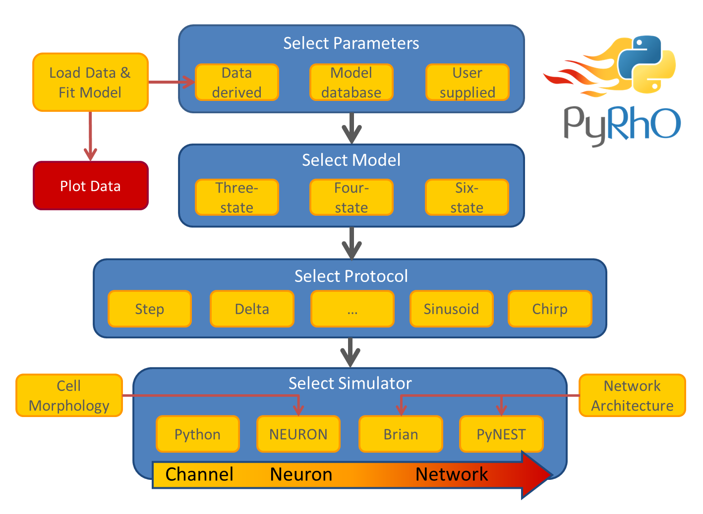

.. PyRhO documentation master file, created by
   sphinx-quickstart on Tue Mar 22 16:26:52 2016.
   You can adapt this file completely to your liking, but it should at least
   contain the root `toctree` directive.

PyRhO documentation
===================

.. automodule:: pyrho
.. currentmodule:: pyrho

Introduction
============

.. include:: ../README.rst

Contents
--------

.. toctree::
   :maxdepth: 2
   
   models
   protocols
   simulators
   expdata
   fitting
   parameters
   utilities
   config

   
Introduction
============

Optogenetics has become a key tool for understanding the function of neural circuits and controlling their behaviour. An array of directly light driven opsins have been genetically isolated from several families of organisms, with a wide range of temporal and spectral properties. In order to characterise, understand and apply these opsins, we present an integrated suite of open-source, multi-scale computational tools called PyRhO. 

PyRhO offers several integrated computational tools for analysing and experimenting with (rhod)opsins in a virtual environment: 

    * The first tool will automatically fit a choice of models to experimental data, extracting the parameters that describe the functional dynamics of the opsins. 
    * The second tool can then take these extracted parameters (or alternatively use default values) and simulate a wide range of experimental protocols to reproduce the photo-response of the opsin of interest. These protocols are typically voltage-clamp experiments and include common engineering inputs such as steps, ramps and chirps, along with more tailored protocols such as pairs of increasingly spaced pulses for evaluating the recovery process. 
    * These models and protocols can be run on several simulation platforms spanning multiple scales (to model isolated opsins or transfected neurons) including: 
    
        * Pure Python for simple channel-level voltage clamp experiments;
        * NEURON for morphologically detailed models of optogenetically transfected neurons; 
        * Brian2 for simulating whole networks with transfected groups of neurons.
    * A Graphical User Interface (GUI) for easy navigation through all tools, running of virtual experiments and sharing of results.

In this way, PyRhO allows the investigator to simulate opsin dynamics on multiple scales from sub-cellular channels, to individual neurons and finally the dynamics of whole networks. This will help to elucidate the link between the biophysics of opsins and the functional implications of their use in a particular biological system.

Abstraction Layers
==================

PyRhO is implemented as a Python package called ``pyrho`` which builds upon popular scientific Python modules including ``scipy``, ``numpy``, ``matplotlib`` and ``lmfit``. Additionally, if optogenetic simulations in detailed morphological models of individual (or a few) neurons are required, ``NMODL`` files (Hines and Carnevale, 2000) are provided for use with NEURON (Hines, Davison and Muller, 2009). Similarly, for network-level simulations PyRhO has been integrated with the Brian simulator (Goodman and Brette, 2008;  2009) and includes model descriptions suitable for use with ``Brian2``. 

The simulation architecture is designed around three layers of abstraction: models, protocols and simulators. These layers are illustrated in the work-flow schematic of :numref:`Figure %s` along with the other major components of PyRhO. Each layer contains families of classes to create a uniform interface for each subclass, for example, the differences in setting the light-dependent transition rates of the three models are shielded from the user by endowing each opsin model subclass with the method ``setLight()``. A similar approach is taken with the other layers providing a common set of member variables and methods, making usage consistent and providing a framework for future development of new subclasses (i.e. additional kinetic models, stimulation protocols and simulation platforms). 

PyRhO contains three abstraction layers which can be used independently of one another. 

* :doc:`models`
    .. automodule:: pyrho.models
* :doc:`protocols`
    .. automodule:: pyrho.protocols
* :doc:`simulators`
    .. automodule:: pyrho.simulators
	

    
Model Fitting
=============

In addition PyRhO has a fitting subpackage for optionally parameterising the rhodopsin 
models with experimental datasets. These must first be loaded into the appropriate data
structures as detailed below. 

:doc:`expdata`
    .. automodule:: pyrho.expdata
    
:doc:`fitting`
    .. automodule:: pyrho.fitting
    

Alternatively, parameters for the models (and protocols and simulators) can be loaded from pre-defined sets. 

:doc:`parameters`
    .. automodule:: pyrho.parameters
    

To aid in the use of these abilities, several utility functions are also provided:

:doc:`utilities`
    .. automodule:: pyrho.utilities
    
:doc:`config`
    .. automodule:: pyrho.config
    

Finally there is an IPython/Jupyter notebook based graphical user interface (GUI) which can be used to fit and simulate the models. 

Examples
========

Several common usage examples are given below which are available as a Jupyter notebook. 

Indices and tables
==================

* :ref:`genindex`
* :ref:`modindex`
* :ref:`search`

